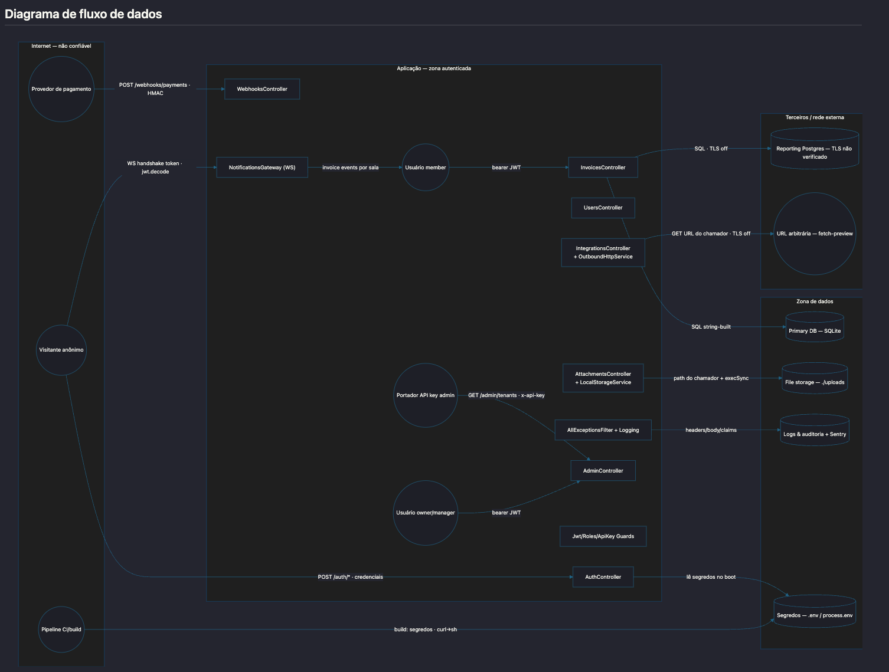
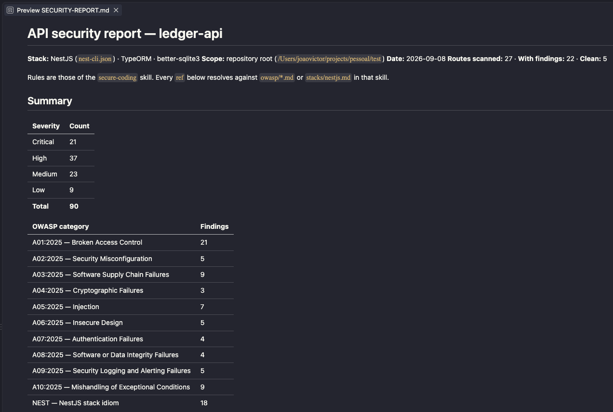
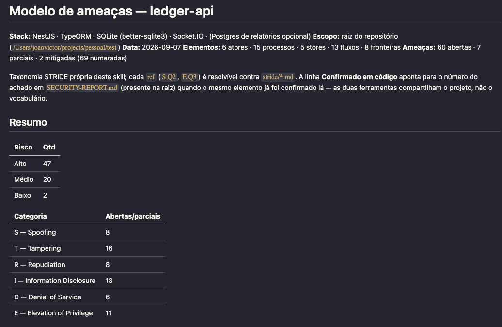

# claude-appsec

**Code security for Claude Code.** Three skills: OWASP Top 10:2025 rules Claude
applies **while it writes your backend code**, `/api-secure-report`, which audits
every HTTP route in a project, and `/app-stride-report`, which maps the system's trust
boundaries and works STRIDE across them.

Markdown the agent reads, plus two read-only commands. Not a scanner — nothing
executes your code, nothing leaves your machine.

<p align="center">
  <a href="examples/example-data-flow-diagram.png">
    
  </a>
</p>
<p align="center"><sub>
  The data-flow diagram <code>/app-stride-report</code> writes into <code>STRIDE-REPORT.md</code>,
  rendered from Mermaid — one of the three skills below. From a real run
  (pt-BR, the default language); click to enlarge.
</sub></p>

## What you get

One plugin, three skills. The first applies itself; the other two are commands.

| Skill | What it does | How you invoke it | What it writes |
|---|---|---|---|
| `secure-coding` | OWASP Top 10:2025 rules Claude reads *before* it writes a route, guard, query, auth flow, config or dependency — then flags what it just wrote, citing the rule id | nothing to run — the trigger in your `CLAUDE.md` loads it | nothing. Inline flags, while you work |
| `api-secure-report` | Every HTTP route in the project, each marked clean or carrying findings: route → vulnerability → how an attacker reaches it → fix | `/api-secure-report [language] [path]` | `SECURITY-REPORT.md` at the project root |
| `app-stride-report` | Decomposes the system into actors, processes, stores, flows and trust boundaries, draws the data-flow diagram, works STRIDE across every element | `/app-stride-report [language] [path]` | `STRIDE-REPORT.md` at the project root |

Both commands take the same two optional arguments: `language` defaults to
`pt-BR`, `path` to the repository root. Both are read-only, and each overwrites
its own document on every run.

*Next: a PR-review skill — the same rules and the same ids, applied to a diff
instead of a repository.*

## Install

Pick one — both give you the same files.

### Option 1 — for you, in every project

```
/plugin marketplace add joaovicdev/claude-appsec
/plugin install claude-appsec@claude-appsec
```

The repository, the marketplace and the plugin are all called `claude-appsec`;
the skill inside it is still `secure-coding`.

Then add the trigger to your global `CLAUDE.md` (or paste
[`TRIGGER.md`](skills/secure-coding/TRIGGER.md) in by hand):

```bash
curl -sL https://raw.githubusercontent.com/joaovicdev/claude-appsec/main/skills/secure-coding/TRIGGER.md \
  >> ~/.claude/CLAUDE.md
```

### Option 2 — for one repository, shared with your team

```bash
git clone https://github.com/joaovicdev/claude-appsec
./claude-appsec/install.sh --project /path/to/your/repo
```

This copies the three skills into `.claude/skills/`, both read-only agents into
`.claude/agents/`, imports the trigger in the repo's `CLAUDE.md`, and gitignores
`SECURITY-REPORT.md` and `STRIDE-REPORT.md`. Commit the result — teammates get it
on their next pull.

> **The trigger is not optional.** *"Add an endpoint"* does not read as a
> security request, so nothing would make Claude open the skill on its own.
> `TRIGGER.md` inlines the eight baseline rules and tells Claude when to load the
> rest. Without it the material sits on disk unused — and you cannot tell.

### Verify

`./install.sh --check /path/to/your/repo` (from a clone) reports what is
installed and whether the trigger is wired. Or ask Claude, inside the project:

1. *"What security rules apply to adding a route that takes an id?"* — must say
   the lookup is scoped by the caller **in the query**; generic "validate your
   input" advice means the trigger never fired.
2. *"Load the secure-coding skill — which manifest row covers CORS?"* — must
   answer `A02`; anything else means Claude cannot find the files.

They fail separately: 1 tests the trigger, 2 the skill.

## `secure-coding` — the rules Claude writes with

No command. The trigger in your `CLAUDE.md` makes Claude open these files before
it touches a route, guard, query, auth flow, config or dependency — so the
unscoped lookup is flagged while the handler is still being written, when the fix
costs nothing, even if you never mentioned security:

```
you    add a GET /orders/:id endpoint

claude … writes the handler, then:

       A01.Q2 — orders.controller.ts:31 — the lookup is by id alone. An
       authenticated user can read any order by guessing the id. The guard
       proved who the caller is, not what they may reach.

       Scoped it in the query predicate instead of checking after the fetch:
         where: { id, tenantId: caller.tenantId }
```

Ten language-agnostic categories in `owasp/`, plus stack idiom for NestJS,
Laravel and Spring Boot. Every rule carries a stable id — `A01.Q2`, `NEST.3` —
that is never renumbered, so a finding written today still resolves in two
years. Category names and numbering follow the OWASP Top 10:2025 — see
[Attribution](#attribution).

## `/api-secure-report` — every route, audited

It enumerates rather than samples: **every** route in the project appears in the
inventory, marked clean or carrying findings, and each finding reads
*route → vulnerability → how an attacker exploits it → fix*, citing the rule id
it came from. The work fans out over read-only `security-auditor` subagents.

<p align="center">
  
</p>
<p align="center"><sub>
  Summary and route inventory from a real run (pt-BR, the default language).
  Full report in English: <a href="examples/SECURITY-REPORT.example.md">examples/SECURITY-REPORT.example.md</a>,
  run against <a href="examples/vulnerable-app/">examples/vulnerable-app/</a>.
</sub></p>

## `/app-stride-report` — the system, modelled

A different question and a different taxonomy: not *"is this line wrong"* but
*"what could go wrong here by design"*. It decomposes the project into actors,
processes, stores, flows and trust boundaries, draws the data-flow diagram at the
top of this page, and works STRIDE across every element — reporting what stops
each threat today, or where it looked and found nothing. STRIDE is Microsoft's
classification — see [Attribution](#attribution).

```
## Matriz STRIDE
✔ sem ameaça aberta · ⚠ parcial ou latente · ✘ aberta · — não se aplica

| Elemento              | S | T | R | I | D | E |
|-----------------------|---|---|---|---|---|---|
| OrdersController      | ✔ | ⚠ | ✘ | ✘ | ✘ | ✘ |
| orders (PostgreSQL)   | — | ✔ | ✘ | ⚠ | ✔ | — |

### TM-01 — OrdersController — Risco alto — `E.Q3`

  Estado atual: aberto — procurado em src/orders/, src/common/guards/ e
  app.module.ts; nenhuma query é escopada pelo chamador.
```

<p align="center">
  
</p>
<p align="center"><sub>
  The same run as the diagram at the top of this page: 69 numbered threats over
  39 elements, counted by risk and by STRIDE category.
  Full example in English: <a href="examples/STRIDE-REPORT.example.md">examples/STRIDE-REPORT.example.md</a> —
  24 threats over 23 elements and 4 trust boundaries, run against
  <a href="examples/vulnerable-app/">examples/vulnerable-app/</a>, with every threat
  the route audit also confirmed linked to it by finding number.
</sub></p>

The threat material shares a plugin with the OWASP material and shares nothing
else: its own files, its own ids, no cross-citation in either direction. That
independence is a check in CI, not a promise — a `stride/` file that cites an
OWASP id fails the build.

## Running the commands

```bash
/api-secure-report                            # pt-BR, whole repository
/api-secure-report en                         # another language; ids, paths and code stay as-is
/api-secure-report pt-BR src/modules/orders   # scoped to a subdirectory

/app-stride-report                            # same two arguments, same defaults
/app-stride-report en
/app-stride-report pt-BR src/modules/payments
```

Each prints to the terminal and writes its document to the project root,
overwriting the previous one. Run them in either order — if `SECURITY-REPORT.md`
already exists, `/app-stride-report` reads it and marks the threats that report
already confirmed in code, citing it by finding number.

## A threat is not a finding

`/api-secure-report` reports defects it opened a file to confirm, so every
finding carries a `file:line`. `/app-stride-report` reports what could go wrong,
including the mitigations that are simply absent — and an absent mitigation has
no line to point at. So instead of a location it owes you an account of where it
searched. A threat with neither is discarded at consolidation, not published.

## Good to know

- **No network.** Plain Markdown, read locally — nothing uploaded, no telemetry.
- **Nothing is modified.** Neither command has `Edit`, and neither
  `security-auditor` nor `threat-modeler` has `Write` or `Edit` — enforced by the
  agent definitions, not requested in a prompt. The only files written are the
  two documents.
- **Both documents are sensitive.** They quote internal paths and spell out how
  to attack them; the threat model maps the surface nobody has tried yet. Keep
  them out of git (`install.sh --project` does; otherwise the skills offer to).
- **A clean document is not proof.** Every run ends with a `Limits` section
  saying what was not covered — read it. The threat model adds `Premissas`,
  because a wrong assumption invalidates every threat resting on it.
- **Stacks.** `nestjs.md` is grounded in production code; `laravel.md` and
  `spring-boot.md` come from the docs and say `Status: unverified`. Any other
  stack gets the language-agnostic core alone — by design, not a degraded mode.
- **Per-project findings.** Copy
  [`templates/SECURITY-NOTES.md`](skills/secure-coding/templates/SECURITY-NOTES.md)
  to a project root; the skill reads it, and the report lists what is there as
  accepted risks instead of new findings.

## Layout

```
.claude-plugin/       plugin.json, marketplace.json — this repo is its own marketplace
skills/
  secure-coding/      SKILL.md (loader + manifest), TRIGGER.md,
                      owasp/    A01..A10, the language-agnostic core
                      stacks/   nestjs, laravel, spring-boot, _TEMPLATE
                      templates/SECURITY-NOTES.md
  api-secure-report/  SKILL.md + references/ — the reference consumer of secure-coding
  app-stride-report/  SKILL.md + references/, and stride/ (S, T, R, I, D, E)
                      its own ids, its own material — cites nothing above it
agents/               security-auditor, threat-modeler — the read-only workers the two
                      commands fan out to. tools: Read, Glob, Grep, Bash. No Write, no Edit
examples/             vulnerable-app/ (a NestJS app that is wrong on purpose), the two
                      documents a run produces against it, and this README's screenshots
install.sh            the non-plugin route: --project, --check
scripts/check-ids.sh  material integrity, run in CI
```

## Contributing

[`CONTRIBUTING.md`](CONTRIBUTING.md) has the recipe for adding a stack file
(`stacks/_TEMPLATE.md` is the blank) and the conventions the material follows.
`./scripts/check-ids.sh` enforces the ones that can be enforced mechanically.

## Attribution

**OWASP.** The category names, numbering, ordering and scope in
`skills/secure-coding/owasp/` follow the
[**OWASP Top 10:2025**](https://owasp.org/Top10/2025/) and were checked against
the official pages, which are the authority — where this repo and OWASP
disagree, OWASP is right and the disagreement is a bug worth filing. This
project is no longer named after OWASP, and that changes nothing about where the
taxonomy comes from. The prose, review questions, pseudocode and grep signals
are original work written for this repository; they are not an OWASP publication.

**STRIDE.** STRIDE is Microsoft's threat classification, published and
unencumbered. The material in `skills/app-stride-report/stride/` — the questions, the
element matrix, the mitigation patterns and the grep signals — is original work
written for this repository and is not a Microsoft publication.

**This project is not affiliated with, endorsed by, or maintained by the OWASP
Foundation or by Microsoft.** "OWASP" is the OWASP Foundation's trademark and
appears here only to identify the material the `secure-coding` skill is built from.

## License

MIT — see [`LICENSE`](LICENSE). MIT does not carry the attribution above into
forks; keeping it is a courtesy to the people who did the underlying work, not a
legal obligation.
