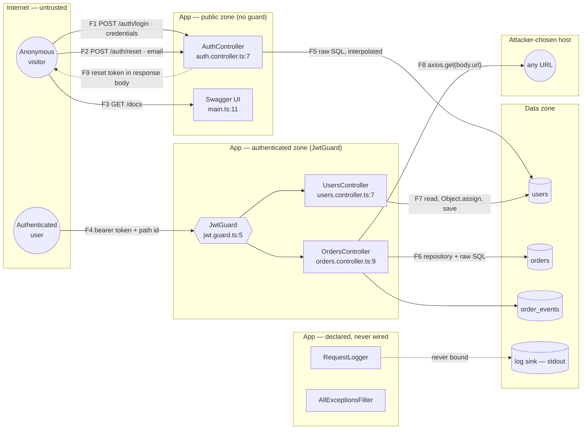

<!--
A real /threat-model run, not a mock-up. Target: examples/vulnerable-app/ in
this repository, a NestJS app that is wrong on purpose. Reproduce it with:

    cp -R examples/vulnerable-app /tmp/run && git -C /tmp/run init -q
    ./install.sh --project /tmp/run
    cd /tmp/run && claude -p "/api-secure-report en" && claude -p "/threat-model en"

Run in that order and the threat model picks up SECURITY-REPORT.md and marks the
threats already confirmed in code. Wording will differ run to run — the
decomposition, the boundaries and the ids should not.
-->

# Threat model — vulnerable-app

**Stack:** NestJS (`nest-cli.json` detected — discovery recipe only)
**Scope:** repository root (`src/`)
**Date:** 2026-09-02
**Elements:** 3 actors · 7 processes · 4 stores · 9 flows · 4 boundaries
**Threats:** 22 open · 2 latent · 0 mitigated

Threats cite `stride/` ids. `Confirmed in code` cites `SECURITY-REPORT.md` by
finding number — the two documents share a project, not a vocabulary.

## Summary

| Risk | Count |
|---|---|
| High | 14 |
| Medium | 9 |
| Low | 1 |

| Category | Threats |
|---|---|
| S — Spoofing | 2 |
| T — Tampering | 6 |
| R — Repudiation | 1 |
| I — Information Disclosure | 8 |
| D — Denial of Service | 3 |
| E — Elevation of Privilege | 4 |

## Data-flow diagram

One `subgraph` per trust boundary. Every arrow leaving one and entering another
is a boundary crossing, and that is where the threats concentrate.

## Trust boundaries

| Boundary | What changes when you cross it | Control | Elements inside |
|---|---|---|---|
| internet → app (public) | input stops being trusted; no identity exists | none | AuthController, Swagger UI |
| anonymous → authenticated | an identity exists and can be attributed | `JwtGuard` | OrdersController, UsersController |
| app → database | a credential is presented; the store trusts whatever asks | one `DataSource` | users, orders, order_events |
| app → arbitrary host | data leaves to a destination **the caller chose** | none | (outbound only) |

The fourth boundary is the one a route-by-route reading does not name: `POST
/orders/import` makes the application a client of whatever URL it is handed, so
the app's network position sits on the untrusted side of a boundary it created.

## Element inventory

| Type | Element | File | Zone | State |
|---|---|---|---|---|
| Actor | Anonymous visitor | — | internet | ⚠ TM-01, TM-07 |
| Actor | Authenticated user | — | internet | ⚠ TM-01 |
| Actor | Import target host | — | external | ⚠ TM-05 |
| Process | AuthController | src/auth/auth.controller.ts:7 | public | ⚠ TM-03, TM-07, TM-08, TM-12, TM-21 |
| Process | JwtGuard | src/auth/jwt.guard.ts:5 | boundary | ⚠ TM-01, TM-02 |
| Process | OrdersController | src/orders/orders.controller.ts:9 | authenticated | ⚠ TM-04, TM-05, TM-10, TM-19, TM-20 |
| Process | UsersController | src/users/users.controller.ts:7 | authenticated | ⚠ TM-06, TM-11, TM-13, TM-24 |
| Process | RequestLogger | src/common/request-logger.middleware.ts:4 | latent | ⚠ TM-16 |
| Process | AllExceptionsFilter | src/common/all-exceptions.filter.ts:4 | latent | ⚠ TM-17 |
| Process | Swagger UI | src/main.ts:11 | public | ⚠ TM-18 |
| Store | users | (TypeORM `DataSource`) | data | ⚠ TM-09, TM-14, TM-23 |
| Store | orders | (TypeORM `DataSource`) | data | ⚠ TM-14, TM-19, TM-23 |
| Store | order_events | (TypeORM `DataSource`) | data | OK — scoped by `tenantId` |
| Store | log sink (stdout) | src/main.ts:6 | data | ⚠ TM-15, TM-16 |
| Flow | F1 visitor → AuthController | auth.controller.ts:11 | crosses | ⚠ TM-03, TM-22 |
| Flow | F2 visitor → AuthController | auth.controller.ts:21 | crosses | ⚠ TM-03, TM-12 |
| Flow | F3 visitor → Swagger UI | main.ts:11 | crosses | ⚠ TM-18 |
| Flow | F4 user → JwtGuard | jwt.guard.ts:10 | crosses | ⚠ TM-01, TM-22 |
| Flow | F5 AuthController → users | auth.controller.ts:13 | crosses | ⚠ TM-14 |
| Flow | F6 OrdersController → orders | orders.controller.ts:24 | crosses | ⚠ TM-14, TM-19 |
| Flow | F7 UsersController → users | users.controller.ts:18 | crosses | ⚠ TM-13, TM-14, TM-24 |
| Flow | F8 OrdersController → any URL | orders.controller.ts:31 | crosses | ⚠ TM-05, TM-20 |
| Flow | F9 AuthController → visitor | auth.controller.ts:26 | crosses | ⚠ TM-08 |

## STRIDE matrix

✔ no open threat (a control is in place, or there is nothing to mitigate) ·
⚠ partial, or real but latent · ✘ open threat · — the category does not apply to
this element type

| Element | S | T | R | I | D | E |
|---|---|---|---|---|---|---|
| Anonymous visitor | ✘ | — | ✘ | — | — | — |
| Authenticated user | ✘ | — | ✘ | — | — | — |
| Import target host | ✘ | — | ✘ | — | — | — |
| AuthController | ✘ | ✘ | ✘ | ✘ | ✘ | ✔ |
| JwtGuard | ✘ | ✔ | ✘ | ✔ | ✔ | ✘ |
| OrdersController | ✔ | ✘ | ✘ | ✘ | ✘ | ✘ |
| UsersController | ✔ | ✘ | ✘ | ✘ | ✔ | ✘ |
| RequestLogger | ✔ | ✔ | ✘ | ⚠ | ✔ | ✔ |
| AllExceptionsFilter | ✔ | ✔ | ✔ | ⚠ | ✔ | ✔ |
| Swagger UI | ✔ | ✔ | ✔ | ✘ | ✔ | ✔ |
| users | — | ✘ | ✘ | ✘ | ✔ | — |
| orders | — | ✘ | ✘ | ✘ | ✘ | — |
| order_events | — | ✔ | ✘ | ✔ | ✔ | — |
| log sink | — | ✔ | ✘ | ⚠ | ✔ | — |
| F1 login request | — | ✘ | — | ✘ | ✘ | — |
| F2 reset request | — | ✘ | — | ✔ | ✘ | — |
| F3 docs request | — | ✔ | — | ✘ | ✔ | — |
| F4 authenticated request | — | ✘ | — | ✔ | ✔ | — |
| F5 auth → users SQL | — | ✘ | — | ✔ | ✔ | — |
| F6 orders → orders SQL | — | ✘ | — | ✔ | ✘ | — |
| F7 users → users SQL | — | ✘ | — | ✔ | ✔ | — |
| F8 outbound fetch | — | ✔ | — | ✘ | ✘ | — |
| F9 reset response | — | ✔ | — | ✘ | ✔ | — |

A cell is ✘ when a threat leaves that element exposed. A system-wide threat is
filed **once**, against the element that owns the fix — TM-15 against the log
sink — and marked on every element it leaves exposed; the threat list, not the
matrix, is the authority on where the fix goes. An actor's cell works the same
way: both human actors are ✘ for spoofing because of TM-01, which is filed
against `JwtGuard`, the process that would fix it.

`order_events` is the one element with a clean confidentiality answer:
`GET /orders/:id/timeline` scopes its query by `tenantId` (`orders.controller.ts:19`).
It is what every other lookup here should look like.

## Threats

### TM-01 — JwtGuard — High risk — `S.Q2`

- **Element:** process `JwtGuard` (`src/auth/jwt.guard.ts:12`)
- **Boundary:** anonymous → authenticated
- **Threat:** The verifier falls back to a hardcoded secret and pins no
  algorithm, issuer or audience, so anyone who has read the source — it ships in
  the repository — can mint a token for any `sub`, `role` and `tenantId`.
- **Attack path:** Sign `{"sub":1,"role":"admin","tenantId":"any"}` with
  `dev-secret-change-me`, send it as `Authorization: Bearer …`, and every route
  behind the guard treats the caller as that identity. No account is needed.
- **Current state:** open — `src/auth/jwt.guard.ts:13` reads
  `process.env.JWT_SECRET || 'dev-secret-change-me'`; `jwt.verify` is called with
  no `algorithms`, `issuer` or `audience` option.
- **Mitigation:** Read the secret with no fallback and fail at boot when it is
  missing. Pin `algorithms`, and verify `issuer` and `audience` on every call.
- **Confirmed in code:** findings #17 and #18 of `SECURITY-REPORT.md`

### TM-02 — JwtGuard — High risk — `E.Q2`

- **Element:** process `JwtGuard` (`src/auth/jwt.guard.ts:5`)
- **Boundary:** anonymous → authenticated
- **Threat:** The only boundary control authenticates and stops there. No
  process behind it asks what the caller may reach, so the design has one
  question — *are you logged in* — standing in for two.
- **Attack path:** Authenticate as any real user, then call any route under
  `/orders` or `/users` with someone else's identifier. Every one succeeds; the
  guard already returned `true`.
- **Current state:** open — searched `src/`, `app.module.ts`; the only
  `@UseGuards` are the two class-level `JwtGuard`s, and no policy, ability or
  role check exists anywhere in the project.
- **Mitigation:** Keep the guard for identity and add an authorization component
  every handler consults, with deny-by-default for a route that declares no rule.
- **Confirmed in code:** findings #7, #9 and #11 of `SECURITY-REPORT.md`

### TM-03 — AuthController — High risk — `T.Q5`

- **Element:** process `AuthController` (`src/auth/auth.controller.ts:13`, `:23`)
- **Boundary:** internet → app (public)
- **Threat:** Both public endpoints build SQL by interpolating the request body
  into the string, so an unauthenticated caller controls the query the database
  runs.
- **Attack path:** `POST /auth/login {"email":"' OR '1'='1' --","password":"x"}`
  returns the first user row and a signed token for it. The same input shape on
  `/auth/reset` rewrites `reset_token` for every row at once.
- **Current state:** open — `auth.controller.ts:14` and `:24` are template
  literals; the project uses `this.db.query` directly with no parameters
  anywhere.
- **Mitigation:** Bind every caller value as a parameter. Neither of these
  queries needs a dynamic identifier, so there is nothing here that binding
  cannot express.
- **Confirmed in code:** findings #1 and #2 of `SECURITY-REPORT.md`

### TM-04 — OrdersController — High risk — `T.Q5`

- **Element:** process `OrdersController` (`src/orders/orders.controller.ts:24`)
- **Boundary:** app → database
- **Threat:** `GET /orders` interpolates both the caller's `tenantId` and the
  `sort` query parameter into raw SQL. `ORDER BY` cannot be parameterised, so
  this is the case that needs an allowlist and does not have one.
- **Attack path:** `GET /orders?sort=(SELECT CASE WHEN (SELECT substr(password,1,1)
  FROM users LIMIT 1)='a' THEN id ELSE email END)` orders the result differently
  depending on the answer, reading the users table one character per request.
- **Current state:** open — `orders.controller.ts:25`; no allowlist, no
  validation pipe registered in `main.ts` to constrain the parameter first.
- **Mitigation:** Map `sort` through a fixed allowlist of column names and reject
  anything outside it. Bind `tenantId` as a parameter.
- **Confirmed in code:** findings #3 and #6 of `SECURITY-REPORT.md`

### TM-05 — OrdersController — High risk — `E.Q7`

- **Element:** process `OrdersController` (`src/orders/orders.controller.ts:31`)
- **Boundary:** app → arbitrary host
- **Threat:** The caller supplies the URL the server fetches, so the process's
  network position is borrowed: the attacker reaches whatever the app can reach
  and gets the response body back.
- **Attack path:** `POST /orders/import {"url":"http://169.254.169.254/latest/meta-data/iam/security-credentials/"}`
  returns the instance's cloud credentials in the response. Internal hostnames
  and `http://127.0.0.1:<port>` admin surfaces are reachable the same way.
- **Current state:** open — `orders.controller.ts:31` passes `body.url` straight
  to `axios.get`; searched `src/` for any allowlist, URL parsing or address check
  and found none.
- **Mitigation:** Allowlist destinations by host. If the caller must choose,
  let it choose an id that maps to a URL the server holds. Resolve the name and
  re-check the address before connecting, refusing loopback, link-local and
  private ranges.
- **Confirmed in code:** findings #4 and #8 of `SECURITY-REPORT.md`

### TM-06 — UsersController — High risk — `E.Q4`

- **Element:** process `UsersController` (`src/users/users.controller.ts:19`)
- **Boundary:** anonymous → authenticated
- **Threat:** `PATCH /users/:id` merges the request body into the loaded entity
  and saves it, so the writable field set is every column the model has —
  including the one that decides privilege.
- **Attack path:** Authenticate as an ordinary user and send
  `PATCH /users/<own id> {"role":"admin"}`. The next token issued for that
  account carries `role: admin`, because login copies the column into the claims
  (`auth.controller.ts:17`).
- **Current state:** open — `users.controller.ts:19` is `Object.assign(user, body)`
  with `@Body() body: any`; `main.ts` registers no global `ValidationPipe`, so
  nothing strips unknown fields upstream either.
- **Mitigation:** Accept an explicit field allowlist and reject unknown fields.
  `role` and `tenantId` are assigned by the server, never accepted as input at
  any endpoint.
- **Confirmed in code:** findings #12 and #13 of `SECURITY-REPORT.md`

### TM-07 — AuthController — High risk — `S.Q6`

- **Element:** process `AuthController` (`src/auth/auth.controller.ts:22`)
- **Boundary:** internet → app (public)
- **Threat:** The password-reset token comes from `Math.random()`, which is not a
  cryptographic source, and carries no expiry and no use count. An identity is
  reachable by prediction rather than by theft.
- **Attack path:** Collect a handful of tokens from your own reset requests,
  recover the generator state, and predict the next token issued for any other
  account. The token is roughly ten characters of `[0-9a-z]` and never expires,
  so offline guessing is also viable.
- **Current state:** open — `auth.controller.ts:22`; searched the project for any
  expiry, `max_uses` or invalidation on `reset_token` and found none.
- **Mitigation:** Generate from the platform's cryptographic random source with
  at least 128 bits of entropy, store a hash of it rather than the token, and
  give it a short expiry and a single use.
- **Confirmed in code:** findings #20 and #28 of `SECURITY-REPORT.md`

### TM-08 — F9 reset response — High risk — `I.Q2`

- **Element:** flow `AuthController → anonymous visitor` (`src/auth/auth.controller.ts:26`)
- **Boundary:** internet → app (public)
- **Threat:** The reset endpoint returns the token it just issued in its own HTTP
  response. The credential is handed to whoever asked, so the design never
  requires the requester to control the mailbox.
- **Attack path:** `POST /auth/reset {"email":"victim@example.com"}` responds
  `{"sent":true,"token":"k3j2h1"}`. Take over the account with an email address
  and one request — no prediction, no interception.
- **Current state:** open — `auth.controller.ts:26` returns `{ sent: true, token }`;
  there is no mail transport in the project at all.
- **Mitigation:** The response says only that a message was sent, whether or not
  the address exists. The token travels to the mailbox and nowhere else.
- **Confirmed in code:** finding #5 of `SECURITY-REPORT.md`

### TM-09 — users store — High risk — `I.Q1`

- **Element:** store `users`
- **Boundary:** app → database
- **Threat:** Passwords are stored as unsalted MD5 and reset tokens in plaintext,
  so obtaining the table once yields the credentials themselves rather than
  material that has to be cracked.
- **Attack path:** Any of the injection paths above returns the `password`
  column. Unsalted MD5 of a human password resolves against public rainbow tables
  in seconds, and the same passwords are then tried elsewhere.
- **Current state:** open — `auth.controller.ts:12` is
  `createHash('md5').update(body.password)`; `auth.controller.ts:24` stores the
  reset token verbatim. No encryption at rest is configured anywhere in the repo.
- **Mitigation:** A memory-hard password hash with a per-user salt, verified with
  a constant-time comparison. Store a hash of the reset token, never the token.
- **Confirmed in code:** finding #19 of `SECURITY-REPORT.md`

### TM-10 — OrdersController — High risk — `I.Q4`

- **Element:** process `OrdersController` (`src/orders/orders.controller.ts:14`)
- **Boundary:** anonymous → authenticated
- **Threat:** `GET /orders/:id` looks the order up by identifier alone. The
  identifier is the authorization, and the caller supplies it.
- **Attack path:** Authenticate as any user and walk `GET /orders/1`,
  `/orders/2`, … Every order in every tenant is returned, including whatever the
  entity carries about the customer.
- **Current state:** open — `orders.controller.ts:14` is
  `findOne({ where: { id } })`. The sibling route at `:19` shows the project
  already knows the pattern: it adds `tenantId: user.tenantId`.
- **Mitigation:** Put the caller's tenant in the predicate, exactly as
  `/orders/:id/timeline` does, so an order that is not theirs is not found rather
  than found and then refused.
- **Confirmed in code:** finding #7 of `SECURITY-REPORT.md`

### TM-11 — UsersController — High risk — `I.Q2`

- **Element:** process `UsersController` (`src/users/users.controller.ts:12`)
- **Boundary:** anonymous → authenticated
- **Threat:** The handler returns the persistence entity, so the response carries
  every column the table has — the password hash and the live reset token
  included — and will carry every column added later.
- **Attack path:** `GET /users/1` as any authenticated user returns that user's
  `password` and `reset_token`. Combined with TM-06 the account is taken over
  without ever cracking the hash.
- **Current state:** open — `users.controller.ts:12` returns `findOne(...)`
  directly; searched the project for any DTO, serializer or interceptor and found
  none.
- **Mitigation:** Return an explicit response shape per endpoint, with sensitive
  fields opt-in, so a column added tomorrow is invisible until someone decides
  otherwise.
- **Confirmed in code:** findings #9 and #10 of `SECURITY-REPORT.md`

### TM-12 — AuthController — High risk — `D.Q1`

- **Element:** process `AuthController` (`src/auth/auth.controller.ts:10`, `:20`)
- **Boundary:** internet → app (public)
- **Threat:** Neither public endpoint has a limit per actor or per unit of time,
  and both are reachable with no identity to attribute the cost to.
- **Attack path:** Credential-stuff `/auth/login` at full rate against the leaked
  password list of your choice. Or drive `/auth/reset` in a loop: each call is an
  unauthenticated write that invalidates the real user's outstanding token.
- **Current state:** open — searched `main.ts`, `app.module.ts` and both
  controllers; ran the D grep signals for `throttle`, `rate`, `limit`, `bucket`,
  `quota` — no throttler module, no guard, not even a commented-out one.
- **Mitigation:** A default limit at the boundary that every route inherits, with
  a stricter one on the credential endpoints keyed by address and by account.
- **Confirmed in code:** finding #16 of `SECURITY-REPORT.md`

### TM-13 — UsersController — High risk — `E.Q3`

- **Element:** process `UsersController` (`src/users/users.controller.ts:18`)
- **Boundary:** anonymous → authenticated
- **Threat:** The write path loads the row by the caller's identifier and never
  checks whose it is. This is the read problem of TM-10 with the blast radius of
  a write.
- **Attack path:** Authenticate as any user and send
  `PATCH /users/<someone else's id> {"password":"…"}` — or `{"role":"user"}` to
  demote an administrator. The entitlement is never consulted.
- **Current state:** open — `users.controller.ts:18` is
  `findOne({ where: { id } })` followed by `repo.save(user)`; no ownership
  comparison exists between them.
- **Mitigation:** Scope the lookup by the caller in the predicate, and require an
  explicit rule for acting on another user's record.
- **Confirmed in code:** finding #11 of `SECURITY-REPORT.md`

### TM-14 — app → database — Medium risk — `T.Q4`

- **Element:** flow `every controller → TypeORM DataSource`
- **Boundary:** app → database
- **Threat:** One `DataSource` serves every controller, so each process holds the
  union of the permissions all of them need. A read-only path can write, and a
  foothold anywhere in the app is a foothold with full database rights.
- **Attack path:** Reach any injection point — TM-03 is unauthenticated — and the
  credential behind it can `UPDATE`, `DROP`, and read every table, not only the
  ones that endpoint legitimately touches.
- **Current state:** open — every controller injects the same `DataSource`
  (`auth.controller.ts:8`, `orders.controller.ts:10`, `users.controller.ts:8`);
  no connection configuration exists in the repository, so the grants themselves
  could not be read. See **Assumptions**.
- **Mitigation:** One credential per process, scoped to what that process
  actually does — read-only where it only reads.

### TM-15 — log sink — Medium risk — `R.Q1`

- **Element:** store `log sink (stdout)`
- **Boundary:** app → database
- **Threat:** No state-changing operation writes a record of who performed it.
  Login, password reset and user modification all leave the system with no way to
  attribute the change afterwards.
- **Attack path:** After exploiting TM-06 to become an administrator, nothing
  distinguishes that request from a legitimate one. The incident cannot be scoped
  and the account cannot be identified.
- **Current state:** open — searched `src/` for `audit`, `trail`, `event` and any
  logger call outside `RequestLogger`; the only logging construct in the project
  is the middleware that is never bound (TM-16).
- **Mitigation:** One record per state change — actor from the verified identity,
  action, resource, outcome, source — written on a path that cannot delete.
- **Confirmed in code:** finding #29 of `SECURITY-REPORT.md`

### TM-16 — RequestLogger — Medium risk — `I.Q5`

- **Element:** process `RequestLogger` (`src/common/request-logger.middleware.ts:8`)
- **Boundary:** app → database
- **Threat:** The middleware stringifies the whole header map and the whole body,
  so bearer tokens, passwords and reset tokens would land in a sink that usually
  has weaker access control than the database.
- **Attack path:** Once bound, `POST /auth/login {"password":"hunter2"}` and every
  `Authorization` header are written verbatim. An attacker with log access — a
  much lower bar than database access — harvests live credentials.
- **Current state:** latent — `app.module.ts:7` declares `RequestLogger` as a
  provider but `AppModule` implements no `configure()`, so the middleware never
  runs. One line makes it live.
- **Mitigation:** Log by allowlist, building the line from named fields. Never
  stringify `headers` or `body`.
- **Confirmed in code:** finding #23 of `SECURITY-REPORT.md`

### TM-17 — AllExceptionsFilter — Low risk — `I.Q3`

- **Element:** process `AllExceptionsFilter` (`src/common/all-exceptions.filter.ts:7`)
- **Boundary:** internet → app
- **Threat:** The filter returns `message`, `stack` and `query` to the caller, so
  a triggered error would describe the schema, the file layout and the SQL being
  run.
- **Attack path:** Once registered, any malformed input returns the driver
  message and the failing query — which is how an attacker maps a database
  without needing the injection to return rows.
- **Current state:** latent — the filter is registered nowhere: `main.ts` has no
  `useGlobalFilters` and `app.module.ts` no `APP_FILTER`. Errors currently take
  the framework default path.
- **Mitigation:** One generic body plus a correlation id for the caller; the
  detail goes to the log only. Then register it — the absence is its own problem
  (finding #34).
- **Confirmed in code:** findings #24 and #34 of `SECURITY-REPORT.md`

### TM-18 — Swagger UI — Medium risk — `I.Q3`

- **Element:** process `Swagger UI` (`src/main.ts:11`)
- **Boundary:** internet → app (public)
- **Threat:** The API description is mounted unauthenticated, and the application
  boots with `logger: ['debug','verbose']`. Together they hand an attacker the
  route map and the verbose internals behind it.
- **Attack path:** `GET /docs` enumerates every route, parameter and shape
  without a single guessed path — including `/orders/import`, which is the entry
  point for TM-05.
- **Current state:** open — `main.ts:11` mounts Swagger with no guard;
  `main.ts:6` sets the debug log levels. No environment condition wraps either.
- **Mitigation:** Mount the docs only outside production, or behind the same
  authentication as everything else. Set log levels from configuration.
- **Confirmed in code:** findings #30 and #31 of `SECURITY-REPORT.md`

### TM-19 — orders store — Medium risk — `D.Q2`

- **Element:** store `orders`, via `OrdersController` (`src/orders/orders.controller.ts:24`)
- **Boundary:** app → database
- **Threat:** `GET /orders` is `SELECT *` with no pagination and no ceiling, so
  one request returns the whole tenant's history and holds a connection for as
  long as that takes.
- **Attack path:** Call it concurrently from a handful of authenticated sessions.
  The connection pool is occupied by full-table reads and every other request —
  including logins — waits behind them.
- **Current state:** open — `orders.controller.ts:25`; searched for `take`,
  `limit`, `offset`, `paginate` across `src/` with no hits.
- **Mitigation:** Paginate with a maximum page size the caller cannot raise, and
  select the columns the response actually needs.

### TM-20 — F8 outbound fetch — Medium risk — `D.Q4`

- **Element:** flow `OrdersController → any URL` (`src/orders/orders.controller.ts:31`)
- **Boundary:** app → arbitrary host
- **Threat:** The outbound call has no timeout, no size limit and no breaker, so
  the destination — which the caller chose — decides how long the handler
  occupies a worker.
- **Attack path:** Point `POST /orders/import` at a host that accepts the
  connection and sends one byte a minute. Repeat until every worker is parked.
  Nothing here needs bandwidth or a botnet.
- **Current state:** open — `orders.controller.ts:31` is a bare `axios.get(...)`
  with no config object; searched for `timeout`, `AbortController`, `retry` and
  `breaker` across `src/` with no hits.
- **Mitigation:** A connect and read timeout on every outbound call, a response
  size ceiling, and a breaker that stops calling a destination already failing.

### TM-21 — AuthController — Medium risk — `I.Q6`

- **Element:** process `AuthController` (`src/auth/auth.controller.ts:16`)
- **Boundary:** internet → app (public)
- **Threat:** Login answers `No user with that email` for an unknown address and
  something else for a wrong password, so the endpoint confirms which addresses
  hold accounts.
- **Attack path:** Feed an address list to `/auth/login` with any password and
  keep the ones whose message differs. Combined with TM-12 the enumeration is
  unthrottled, and the result feeds the credential stuffing directly.
- **Current state:** open — `auth.controller.ts:16` throws a message naming the
  cause; there is no user-not-found path that behaves identically to a
  wrong-password path.
- **Mitigation:** One response for both cases, and comparable timing — do the
  hash comparison even when no user was found.
- **Confirmed in code:** finding #16 of `SECURITY-REPORT.md`

### TM-22 — F1/F4 inbound requests — Medium risk — `T.Q1`

- **Element:** flows `visitor → AuthController`, `user → JwtGuard`
- **Boundary:** internet → app
- **Threat:** The application listens on plain HTTP and the repository configures
  no transport security, so credentials and bearer tokens cross the boundary in
  whatever the deployment happens to provide.
- **Attack path:** On any path where TLS is not terminated in front of the app,
  reading one `POST /auth/login` yields the password and one authenticated
  request yields a token usable until it expires.
- **Current state:** open — `main.ts:13` is `app.listen(process.env.PORT || 3000)`
  with no HTTPS options; there is no reverse-proxy, ingress or compose file in
  the repository to show what sits in front. See **Assumptions**.
- **Mitigation:** Terminate TLS in front of the app and refuse plaintext, with a
  strict transport header set at the edge.

### TM-23 — users and orders stores — Medium risk — `T.Q6`

- **Element:** stores `users`, `orders`
- **Boundary:** app → database
- **Threat:** Rows are updated in place with no previous value and no actor
  recorded, so a malicious change and a legitimate edit are indistinguishable
  after the fact.
- **Attack path:** After TM-06 sets `role` to `admin`, revert it an hour later.
  The table shows the current value and nothing else; there is no `updated_by`,
  no revision, no history table.
- **Current state:** open — `users.controller.ts:20` is `repo.save(user)` and
  `auth.controller.ts:24` a bare `UPDATE`; searched for `updated_by`, `audit`,
  `revision`, `history` and `version` across the project with no hits.
- **Mitigation:** Append-only history for the columns whose past matters —
  privilege above all — with the actor taken from the verified identity.

### TM-24 — UsersController — High risk — `T.Q3`

- **Element:** process `UsersController` (`src/users/users.controller.ts:19`)
- **Boundary:** anonymous → authenticated
- **Threat:** The writable field set is not declared anywhere — it is whatever
  the entity happens to have. TM-06 is what that costs today; this is why it will
  cost more tomorrow, because every column added later becomes writable the day
  it is added, with no code change and no review.
- **Attack path:** `PATCH /users/:id {"password":"<md5 of a known string>"}`
  overwrites the stored hash directly, skipping the reset flow entirely. The same
  request sets `tenantId`, moving the account into another tenant's data.
- **Current state:** open — `users.controller.ts:16` types the body as `any` and
  `:19` merges it wholesale; `main.ts` registers no `ValidationPipe`, so no
  unknown-field rejection happens upstream either.
- **Mitigation:** An explicit allowlist of updatable fields, rejecting unknown
  ones, declared per endpoint rather than inherited from the persistence model.
- **Confirmed in code:** finding #13 of `SECURITY-REPORT.md`

## Accepted risks

No `SECURITY-NOTES.md` exists at the scan root, so there is nothing to reconcile
and every threat above is reported fresh.

## Assumptions

Each of these is a judgment made during decomposition. A wrong one invalidates
the threats resting on it, which is why they are listed rather than left
implicit.

- **The database credential is broadly privileged.** No connection configuration,
  migration or entity definition exists in the repository, so TM-14 assumes the
  single `DataSource` holds full rights on the schema. If it is already scoped
  per process, TM-14 does not apply.
- **Nothing terminates TLS in front of the app.** There is no proxy, ingress,
  compose file or deployment manifest in the repository. TM-22 assumes the
  listener is reached directly; behind a terminating edge its risk drops to low.
- **The schemas were inferred from usage.** `password`, `role`, `tenant_id` and
  `reset_token` on `users`, `tenant_id` on `orders`, and `tenantId` on
  `order_events` are read from the queries, not from a definition.
- **`RequestLogger` and `AllExceptionsFilter` are unreachable as committed.**
  `AppModule` implements no `configure()` and nothing registers a global filter.
  TM-16 and TM-17 are rated as latent on that basis; both become high the moment
  either is wired.
- **The three actors are distinct in what they may reach.** The model treats
  anonymous and authenticated as separate actors. It does not model an
  administrator as a fourth, because `role` exists in the token but no code reads
  it — the privilege it names is not yet enforced anywhere.

## Limits of this model

- **Coverage:** all 9 source files in `src/` were read, plus `package.json`,
  `nest-cli.json` and `app.module.ts`. 23 of 23 decomposed elements were
  analysed, producing 24 threats.
- **Not decomposed:** there is no infrastructure in this repository — no
  Dockerfile, compose file, CI workflow, migration or test. The deployment
  topology, the network the app sits on, and everything in front of it are
  outside the model and are the subject of two entries under **Assumptions**.
- **Not modelled:** the build and release path. `package.json` declares a
  `postinstall` hook and unpinned dependency ranges with no lockfile; those cross
  a build → runtime boundary that this scope, the running system, does not cover.
  They are reported as code findings (#25, #26, #27, #35) rather than as threats
  here.
- **Static only.** No runtime, database or network testing was performed. Every
  attack path above is derived from reading the code.
- **Absence of a threat is not proof of absence of risk.** A threat citing `E.Q7`
  is resolvable against `stride/E-elevation-of-privilege.md`.
