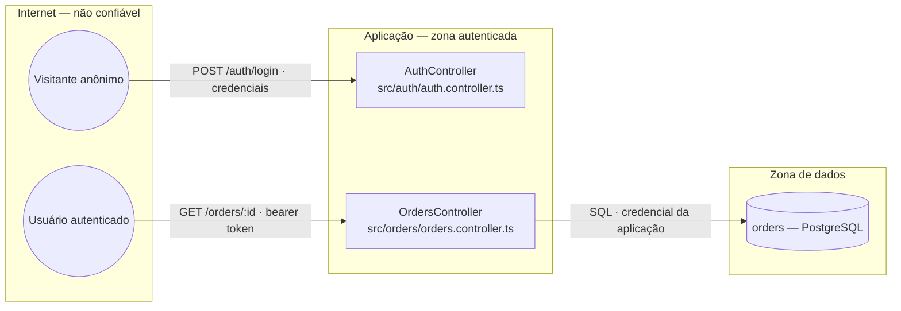

# Report format

Three contracts: what a subagent returns, how risk is decided, and the shape of
the final document.

## 1. Subagent return contract

A subagent returns zero or more blocks and nothing else — no preamble, no
summary, no reassurance that it looked carefully. One block per threat:

```
--- THREAT
element: actor | process | flow | store
name: OrdersController
boundary: internet -> app
ref: E.Q2                        # an id that exists in the stride/ files
status: unmitigated | partial | mitigated | n/a
evidence: src/orders/orders.controller.ts:31
impact: high | medium | low
likelihood: high | medium | low
threat: <what an attacker does, one or two sentences>
attack: <the concrete path — the request, the sequence, the precondition>
mitigation: <what closes it, in this project's own idiom>
--- END
```

### The evidence rule

A threat is a hypothesis with a status; a finding is a confirmed defect. That
difference is why `evidence` is not a file reference and nothing else:

> **`evidence` is either the `file:line` of the control that was found, or the
> paths searched and the grep signals run that found nothing.** "There is no rate
> limit" is a claim about a search, and the search has to be visible. A
> `status: unmitigated` with no account of where the agent looked is discarded at
> consolidation — not because the threat is wrong, but because nobody can check
> it.

Both of these are complete evidence:

```
evidence: src/common/guards/jwt.guard.ts:22 — verifies signature, no audience check
evidence: searched src/orders/, src/common/, app.module.ts; ran the D grep signals — no throttler, no per-actor limit
```

Everything else the contract enforces:

- **`ref` must exist.** `S.Q1`–`S.Q6`, `T.Q1`–`T.Q6`, `R.Q1`–`R.Q5`,
  `I.Q1`–`I.Q6`, `D.Q1`–`D.Q6`, `E.Q1`–`E.Q7`. If nothing fits, the gap belongs
  in the `stride/` files as a new threat question — never invented in a report.
- **`ref` must be one the element can carry.** The matrix in
  `decomposition.md` is binding: a store cannot carry an `S.*`, a flow cannot
  carry an `E.*`. A threat filed against the wrong element type is a
  decomposition error wearing a threat's clothes.
- **`attack` is concrete.** "An attacker could gain unauthorized access" is not
  an attack path. "Register any account, call `GET /orders/9001` with an id
  belonging to another tenant, receive the order with the customer's address" is.
- **`mitigation` names the construct this project would use**, not "add proper
  authorization".
- **`status: n/a`** is a real answer and worth returning when the reason is not
  obvious — it stops the next reader from re-deriving it.
- Write in **English**. Translation happens once, at consolidation.

## 2. Risk

Impact and likelihood are judged separately, then combined. Judging them
together is how everything becomes "medium".

| Level | Impact — what it costs if it happens | Likelihood — what it takes to do it |
|---|---|---|
| **high** | mass data access, privilege escalation, arbitrary code, money moved, the system down for everyone | no precondition worth stating: anyone who can reach the endpoint |
| **medium** | one actor's data, one tenant's data, a leak that enables the next step, degraded service | a real precondition — a role, a race, a specific configuration |
| **low** | bounded and non-sensitive; defense in depth | a chain of preconditions, or an attacker position that implies worse access already |

| | Impact high | Impact medium | Impact low |
|---|---|---|---|
| **Likelihood high** | Alto | Alto | Médio |
| **Likelihood medium** | Alto | Médio | Baixo |
| **Likelihood low** | Médio | Baixo | Baixo |

A `status: mitigated` threat keeps its impact and likelihood — they describe the
threat, not the residual. It is listed in the matrix, not in the threat list.

## 3. Document template

Below is the `pt-BR` rendering, which is the default. For another language,
translate labels and prose and keep the structure, the ids, the paths and the
code exactly as they are.

````markdown
# Modelo de ameaças — <projeto>

**Stack:** <detectada, ou "nenhuma detectada">
**Escopo:** <raiz do repositório, ou o caminho passado>
**Data:** <YYYY-MM-DD>
**Elementos:** <n> atores · <n> processos · <n> stores · <n> fluxos · <n> fronteiras
**Ameaças:** <n> abertas · <n> parciais · <n> mitigadas

## Resumo

| Risco | Qtd |
|---|---|
| Alto | 3 |
| Médio | 5 |
| Baixo | 2 |

| Categoria | Abertas |
|---|---|
| S — Spoofing | 1 |
| E — Elevation of Privilege | 4 |

## Diagrama de fluxo de dados



Uma `subgraph` por fronteira de confiança. Toda seta que sai de uma `subgraph` e
entra em outra é um cruzamento de fronteira, e é onde as ameaças se concentram.

## Fronteiras de confiança

| Fronteira | O que muda ao cruzar | Elementos do lado interno |
|---|---|---|
| internet → app | a entrada deixa de ser confiável; o chamador é desconhecido | AuthController, OrdersController |
| app → dados | credencial é apresentada; o store confia em quem perguntar | orders (PostgreSQL) |

## Inventário de elementos

Todo elemento decomposto, com ameaça ou sem.

| Tipo | Elemento | Arquivo | Zona | Estado |
|---|---|---|---|---|
| Processo | OrdersController | src/orders/orders.controller.ts:31 | app | ⚠ TM-01, TM-04 |
| Processo | AuthController | src/auth/auth.controller.ts:18 | app | OK |
| Store | orders (PostgreSQL) | src/app.module.ts:22 | dados | ⚠ TM-06 |

## Matriz STRIDE

✔ sem ameaça aberta (há controle, ou não há o que mitigar) · ⚠ parcial ou
latente · ✘ ameaça aberta · — a categoria não se aplica a este tipo de elemento

| Elemento | S | T | R | I | D | E |
|---|---|---|---|---|---|---|
| Usuário autenticado | ✔ | — | ✘ | — | — | — |
| OrdersController | ✔ | ⚠ | ✘ | ✘ | ✘ | ✘ |
| orders (PostgreSQL) | — | ✔ | ✘ | ⚠ | ✔ | — |

## Ameaças

### TM-01 — OrdersController — Risco alto — `E.Q3`

- **Elemento:** processo `OrdersController` (`src/orders/orders.controller.ts:31`)
- **Fronteira:** internet → app
- **Ameaça:** <o que um atacante faz, uma ou duas frases>
- **Caminho de ataque:** <passos concretos, com a requisição>
- **Estado atual:** aberto — <o que foi encontrado, ou onde se procurou e não achou>
- **Mitigação:** <o que fecha, no idioma deste projeto>
- **Confirmado em código:** achado #7 de `SECURITY-REPORT.md`

### TM-02 — …

## Riscos já aceitos

De `SECURITY-NOTES.md` — não são ameaças novas.

| ID | Ref | Risco | Revisar quando |
|---|---|---|---|
| R-1 | `<ref>` | … | … |

## Premissas

Toda suposição feita na decomposição. Uma premissa errada invalida as ameaças
que dependem dela — por isso elas ficam visíveis, e não implícitas.

- <o que se assumiu sobre o deploy, a rede, quem opera, o que existe fora do repo>

## Limites deste modelo

- <o que não foi decomposto, e por quê>
- <serviços fora deste repositório, gateway upstream, infraestrutura externa>
- Elementos efetivamente lidos: <n> de <n>.
- Ausência de ameaça não é prova de ausência de risco. Uma ameaça citando `E.Q3`
  é resolvível contra `stride/E-elevation-of-privilege.md`.
````

The **Premissas** and **Limites** sections are not optional and are never empty.
A threat model that hides what it assumed is a threat model nobody can correct.

### The one line that is never translated

`Confirmado em código` appears only when `SECURITY-REPORT.md` exists at the scan
root and one of its findings lands on the same element. Reference it **by the
finding's number**, never by the taxonomy that report uses — the two documents
share a project, not a vocabulary.
