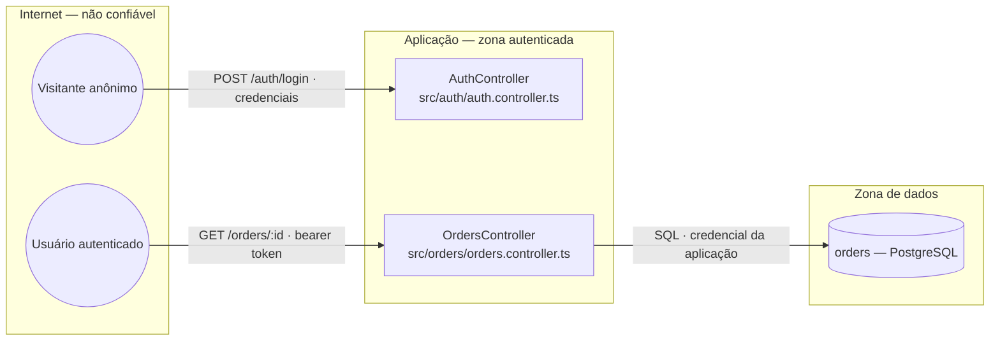

# Report format

Three contracts: what a subagent returns, how risk is decided, and the shape of
the final document.

## 1. Subagent return contract

A subagent returns zero or more blocks and nothing else — no preamble, no
summary, no reassurance that it looked carefully. One block per threat:

```
--- THREAT
element: actor | process | flow | store
name: OrdersController
boundary: internet -> app
ref: E.Q2                        # an id that exists in the stride/ files
status: unmitigated | partial | mitigated | n/a
evidence: src/orders/orders.controller.ts:31
impact: high | medium | low
likelihood: high | medium | low
profile: P7 | —                  # a profile claim that explains this, if any
threat: <what an attacker does, one or two sentences>
attack: <the concrete path — the request, the sequence, the precondition>
mitigation: <what closes it, in this project's own idiom>
--- END
```

### The evidence rule

A threat is a hypothesis with a status; a finding is a confirmed defect. That
difference is why `evidence` is not a file reference and nothing else:

> **`evidence` is either the `file:line` of the control that was found, or the
> paths searched and the grep signals run that found nothing.** "There is no rate
> limit" is a claim about a search, and the search has to be visible. A
> `status: unmitigated` with no account of where the agent looked is discarded at
> consolidation — not because the threat is wrong, but because nobody can check
> it.

Both of these are complete evidence:

```
evidence: src/common/guards/jwt.guard.ts:22 — verifies signature, no audience check
evidence: searched src/orders/, src/common/, app.module.ts; ran the D grep signals — no throttler, no per-actor limit
```

Everything else the contract enforces:

- **`ref` must exist.** `S.Q1`–`S.Q6`, `T.Q1`–`T.Q6`, `R.Q1`–`R.Q5`,
  `I.Q1`–`I.Q6`, `D.Q1`–`D.Q6`, `E.Q1`–`E.Q7`. If nothing fits, the gap belongs
  in the `stride/` files as a new threat question — never invented in a report.
- **`ref` must be one the element can carry.** The matrix in
  `decomposition.md` is binding: a store cannot carry an `S.*`, a flow cannot
  carry an `E.*`. A threat filed against the wrong element type is a
  decomposition error wearing a threat's clothes.
- **`attack` is concrete.** "An attacker could gain unauthorized access" is not
  an attack path. "Register any account, call `GET /orders/9001` with an id
  belonging to another tenant, receive the order with the customer's address" is.
- **`mitigation` names the construct this project would use**, not "add proper
  authorization".
- **`status: n/a`** is a real answer and worth returning when the reason is not
  obvious — it stops the next reader from re-deriving it.
- Write in **English**. Translation happens once, at consolidation.

## 2. Risk

Impact and likelihood are judged separately, then combined. Judging them
together is how everything becomes "medium".

| Level | Impact — what it costs if it happens | Likelihood — what it takes to do it |
|---|---|---|
| **high** | mass data access, privilege escalation, arbitrary code, money moved, the system down for everyone | no precondition worth stating: anyone who can reach the endpoint |
| **medium** | one actor's data, one tenant's data, a leak that enables the next step, degraded service | a real precondition — a role, a race, a specific configuration |
| **low** | bounded and non-sensitive; defense in depth | a chain of preconditions, or an attacker position that implies worse access already |

| | Impact high | Impact medium | Impact low |
|---|---|---|---|
| **Likelihood high** | Alto | Alto | Médio |
| **Likelihood medium** | Alto | Médio | Baixo |
| **Likelihood low** | Médio | Baixo | Baixo |

A `status: mitigated` threat keeps its impact and likelihood — they describe the
threat, not the residual. It is listed in the matrix, not in the threat list.

## 3. Identity, status and the ledger

A model is regenerated whole on every run: **the prose is replaced, the identity
is not.** `appsec-profile` merges because a human edits it; this document does
not merge, because nothing in it is hand-written. What crosses runs is the id,
the date the threat was first seen, its status history, and its regression test.

### The id

`TM-<n>`, issued once and **never renumbered, never reused**. Still never
`T-<n>` — `T` is Tampering. No zero padding: `TM-3`, `TM-142`, like `P7` in the
profile. `TM-01` only ever made sense while the number carried the ordering, and
ordering is by risk, which changes every run.

The **natural key** is `(element name, ref)`.

That key only works if element names hold still, so the rule the decomposition
already applies to boundaries applies to every element: **an element a previous
model already names keeps that name, verbatim.** Two runs that decompose the same
system correctly but call `OrdersController` by two names produce two threats
where there is one.

### Reconciling a run against the ledger

In this order, and never by prose similarity:

1. Match by `(element, ref)`.
2. Exactly one unmatched threat on each side sharing a key → the same threat; the
   id carries over.
3. Several sharing a key → pair them by the element's `file:line`, nearest wins.
   Leftovers are new.
4. A ledger row nothing matched this run → `fixed`, dated today.
5. A match whose ledger status was `fixed` → `reopened`, **the same id**.
6. Anything still unmatched → a new id at the next number.

### Status tokens

Four tokens, **fixed English, never translated**, appended to the threat heading
— literal strings, because a consumer greps them:

```
[new]                    first run this threat appeared in
[open since <date>]      carried over unchanged
[reopened <date>]        matched again after having been fixed
[fixed <date>]           matched nothing this run
```

A `[fixed …]` threat appears **only** in `## Desde a execução anterior`, for
exactly one run, and then leaves the document. Its ledger row stays, so a reopen
gets its id back.

### The ledger

An HTML comment on the last lines of the document — self-contained, exactly like
the profile's ledger. Every column is an id, a ref, a name or a date, so the
block is identical whatever language the prose was written in.

```
<!-- appsec-ledger · schema 1 · stride · ids issued: TM-1..TM-41 · from 324304f on 2026-09-13
TM-3  | E.Q3 | OrdersController | open  | 2026-08-15 | 2026-09-13 | test/orders.security.spec.ts · 2026-09-12 · red→green
TM-9  | I.Q1 | users store      | open  | 2026-08-15 | 2026-09-13 | —
TM-15 | R.Q1 | log sink         | fixed | 2026-08-15 | 2026-09-10 | —
-->
```

`id | ref | key | status | first seen | last seen | test`

If the comment is gone, fall back to `max(id present)` and **say so in the
terminal summary** — from that point a number can be reused, and a test pointing
at `TM-15` would resolve to the wrong threat.

### The `test` column has one writer, and it is not this skill

`/appsec-test` fills it, and fills nothing else: never an id, never `status`,
never the order. A green test is evidence, not proof the threat is closed —
whether it is still open is decided here, by re-reading the code.

## 4. Document template

Below is the `pt-BR` rendering, which is the default. For another language,
translate labels and prose and keep the structure, the ids, the paths and the
code exactly as they are.

````markdown
# Modelo de ameaças — <projeto>

**Stack:** <detectada, ou "nenhuma detectada">
**Escopo:** <raiz do repositório, ou o caminho passado>
**Data:** <YYYY-MM-DD> · **Commit:** `<sha>`
**Elementos:** <n> atores · <n> processos · <n> stores · <n> fluxos · <n> fronteiras
**Ameaças:** <n> abertas · <n> parciais · <n> mitigadas
**Com teste de regressão:** <n> de <n> ameaças

## Resumo

| Risco | Qtd |
|---|---|
| Alto | 3 |
| Médio | 5 |
| Baixo | 2 |

| Categoria | Abertas |
|---|---|
| S — Spoofing | 1 |
| E — Elevation of Privilege | 4 |

## Desde a execução anterior

Anterior: <YYYY-MM-DD>, commit `<sha>` — `appsec/history/stride-<YYYY-MM-DD>-<sha>.md`.

| | Qtd | Ids |
|---|---|---|
| Novas | 2 | TM-40, TM-41 |
| Reabertas | 1 | TM-15 |
| Corrigidas | 3 | TM-6, TM-11, TM-27 |
| Inalteradas | 19 | — |

## Diagrama de fluxo de dados


```mermaid
flowchart LR
  subgraph internet["Internet — não confiável"]
    A1(("Visitante anônimo"))
    A2(("Usuário autenticado"))
  end
  subgraph app["Aplicação — zona autenticada"]
    P1["AuthController<br/>src/auth/auth.controller.ts"]
    P2["OrdersController<br/>src/orders/orders.controller.ts"]
  end
  subgraph dados["Zona de dados"]
    S1[("orders — PostgreSQL")]
  end
  A1 -->|"POST /auth/login · credenciais"| P1
  A2 -->|"GET /orders/:id · bearer token"| P2
  P2 -->|"SQL · credencial da aplicação"| S1
```

Uma `subgraph` por fronteira de confiança. Toda seta que sai de uma `subgraph` e
entra em outra é um cruzamento de fronteira, e é onde as ameaças se concentram.

## Fronteiras de confiança

| Fronteira | O que muda ao cruzar | Elementos do lado interno |
|---|---|---|
| internet → app | a entrada deixa de ser confiável; o chamador é desconhecido | AuthController, OrdersController |
| app → dados | credencial é apresentada; o store confia em quem perguntar | orders (PostgreSQL) |

## Inventário de elementos

Todo elemento decomposto, com ameaça ou sem.

| Tipo | Elemento | Arquivo | Zona | Estado |
|---|---|---|---|---|
| Processo | OrdersController | src/orders/orders.controller.ts:31 | app | ⚠ TM-01, TM-04 |
| Processo | AuthController | src/auth/auth.controller.ts:18 | app | OK |
| Store | orders (PostgreSQL) | src/app.module.ts:22 | dados | ⚠ TM-06 |

## Matriz STRIDE

✔ sem ameaça aberta (há controle, ou não há o que mitigar) · ⚠ parcial ou
latente · ✘ ameaça aberta · — a categoria não se aplica a este tipo de elemento

| Elemento | S | T | R | I | D | E |
|---|---|---|---|---|---|---|
| Usuário autenticado | ✔ | — | ✘ | — | — | — |
| OrdersController | ✔ | ⚠ | ✘ | ✘ | ✘ | ✘ |
| orders (PostgreSQL) | — | ✔ | ✘ | ⚠ | ✔ | — |

## Ameaças

### TM-3 — OrdersController — Risco alto — `E.Q3` [open since 2026-08-15] [tested 2026-09-12]

- **Elemento:** processo `OrdersController` (`src/orders/orders.controller.ts:31`)
- **Fronteira:** internet → app
- **Ameaça:** <o que um atacante faz, uma ou duas frases>
- **Caminho de ataque:** <passos concretos, com a requisição>
- **Estado atual:** aberto — <o que foi encontrado, ou onde se procurou e não achou>
- **Mitigação:** <o que fecha, no idioma deste projeto>
- **Confirmado em código:** achado SEC-7 de `appsec/security-report.md`
- **Teste de regressão:** `test/orders.security.spec.ts` — provado vermelho em
  2026-09-12, corrigido na mesma mudança

### TM-41 — AttachmentsController — Risco médio — `I.Q3` [new]

## Riscos já aceitos

De `SECURITY-NOTES.md` — não são ameaças novas.

| ID | Ref | Risco | Revisar quando |
|---|---|---|---|
| R-1 | `<ref>` | … | … |

## Premissas

Toda suposição feita na decomposição. Uma premissa errada invalida as ameaças
que dependem dela — por isso elas ficam visíveis, e não implícitas.

- <o que se assumiu sobre o deploy, a rede, quem opera, o que existe fora do repo>
- Perfil `appsec/profile.md` (<YYYY-MM-DD>): claims usadas — <P3, P4, P7>.
  Uma claim errada invalida o que dependeu dela.

## Limites deste modelo

- <o que não foi decomposto, e por quê>
- <serviços fora deste repositório, gateway upstream, infraestrutura externa>
- Elementos efetivamente lidos: <n> de <n>.
- Perfil de arquitetura: `appsec/profile.md`, gerado em <YYYY-MM-DD> no
  commit `<sha>` — <n> ameaças removidas por claims do perfil (<P7, P9>), <n>
  claims ignoradas por âncora ausente. Sem perfil: "nenhum perfil — nada foi
  removido".
- Ausência de ameaça não é prova de ausência de risco. Uma ameaça citando `E.Q3`
  é resolvível contra `stride/E-elevation-of-privilege.md`.

<!-- appsec-ledger · schema 1 · stride · ids issued: TM-1..TM-41 · from <sha> on <YYYY-MM-DD>
TM-3  | E.Q3 | OrdersController        | open | 2026-08-15 | 2026-09-13 | test/orders.security.spec.ts · 2026-09-12 · red→green
TM-41 | I.Q3 | AttachmentsController   | open | 2026-09-13 | 2026-09-13 | —
-->
````

The **Premissas** and **Limites** sections are not optional and are never empty.
A threat model that hides what it assumed is a threat model nobody can correct.

The profile lines carry the **ids**, never the items. A threat removed by a claim
appears nowhere else in this document, so those two lines are the only accounting
that exists. `Premissas` is where a relied-on claim belongs, because that section
already says what a wrong premise does to everything resting on it.

### The one line that is never translated

`Confirmado em código` appears only when `appsec/security-report.md` exists at
the scan root and one of its findings lands on the same element. Reference it
**by that finding's durable id** — `SEC-7` — never by the taxonomy that report
uses. The two documents share a project, not a vocabulary.

The id is durable on both sides now, so the citation survives a regeneration of
either document. It used to be a finding *number*, which was re-derived on every
run: a model written on Monday cited findings that had moved by Tuesday.
